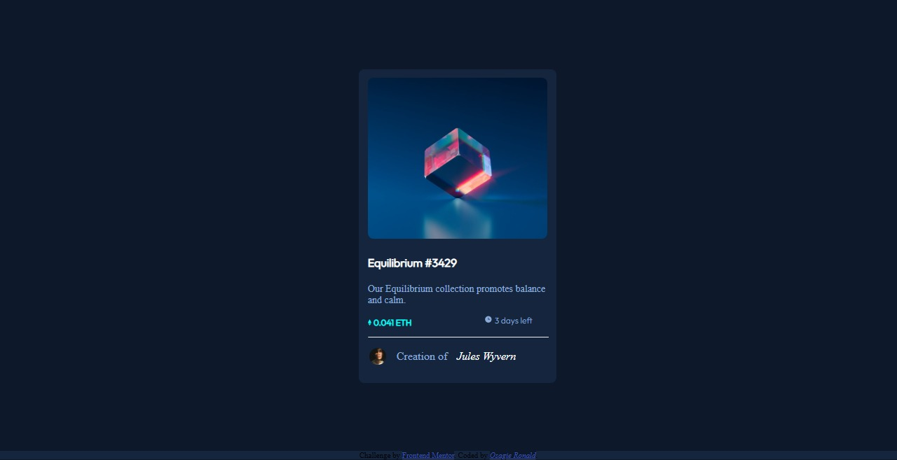

# Nft_preview
# Frontend Mentor - NFT preview card component solution

This is a solution to the [NFT preview card component challenge on Frontend Mentor](https://www.frontendmentor.io/challenges/nft-preview-card-component-SbdUL_w0U). Frontend Mentor challenges help you improve your coding skills by building realistic projects. 

## Table of contents

- [Overview](#overview)
  - [The challenge](#the-challenge)
  - [Screenshot](#screenshot)
  - [Links](#links)
- [My process](#my-process)
  - [Built with](#built-with)
  - [What I learned](#what-i-learned)
  - [Continued development](#continued-development)
  - [Useful resources](#useful-resources)
- [Author](#author)
- [Acknowledgments](#acknowledgments)


## Overview

### The challenge

Users should be able to:

- View the optimal layout depending on their device's screen size
- See hover states for interactive elements

### Screenshot

 and (mobile_screen_shot.PNG)


### Links

- Solution URL: https://github.com/Osagie007/Nft_preview
- Live Site URL: https://osagie007.github.io/Nft_preview/

## My process

### Built with

- Semantic HTML5 markup
- CSS custom properties
- Flexbox

### What I learned


```html
<div class="first_item"> Equilibrium #3429</div>
```
```css
 .first_item {
      color: hsl(0, 0%, 100%);
       }
```
### Continued development

This project exposed many weaknesses in my coding and i will have to dive deeper into the word of responsive web design in order to become better. I will also be going into javascript proper.

### Useful resources

- [W3Schools](https://www.w3schools.com/howto/howto_css_image_overlay.asp) - This helped me overlay the icon-view picture on the image-equilibrium picture.. I really liked this pattern and will use it going forward.
- [Stack Overflow](https://www.StackOverflow.com) - This was my go to site when i had any type of issues. i realized that others before me had gone through those problems and solutions were available. I'd recommend it to anyone still to code.

## Author

- Website - [Eluojerio Osagie .R.](https://github/Osagie007.com)
- Frontend Mentor - [@Osagie007](https://www.frontendmentor.io/profile/Osagie007)
- Twitter - [@OsagieRonald](https://www.twitter.com/OsagieRonald)

## Acknowledgments
 I have no one to thank the people that taught me html and css @CS50, @Eniola and @Damilola_Adekoya

i
